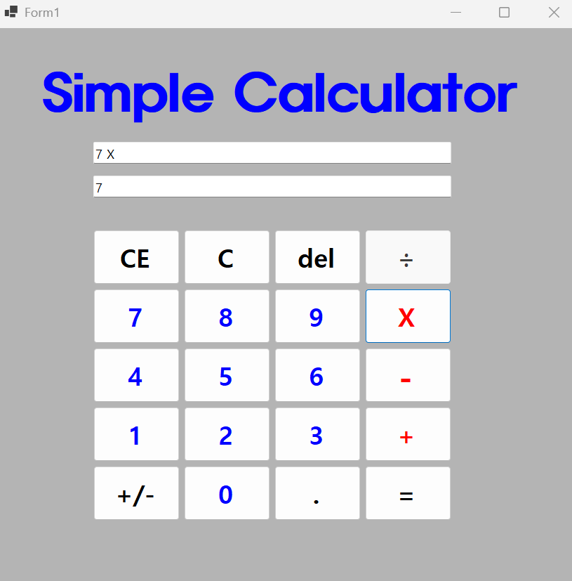
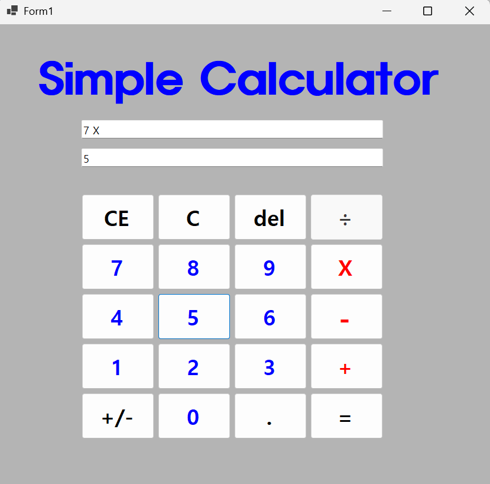
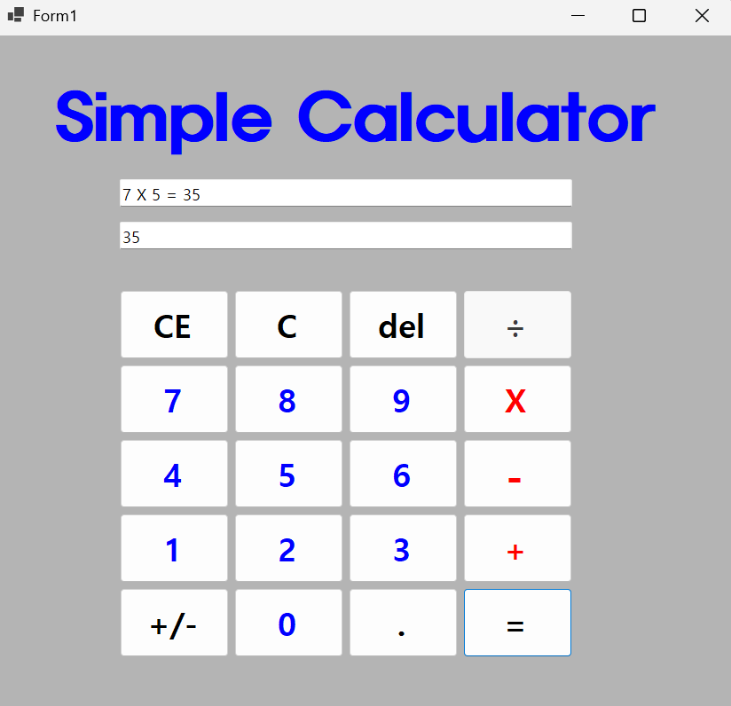
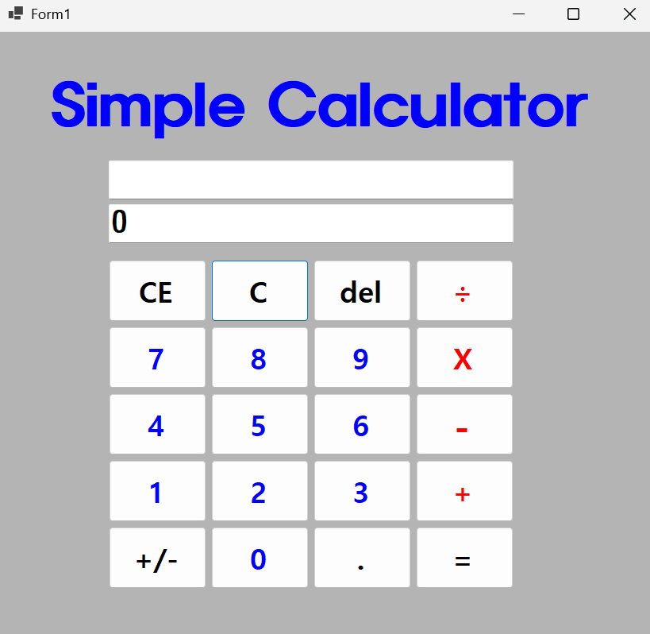
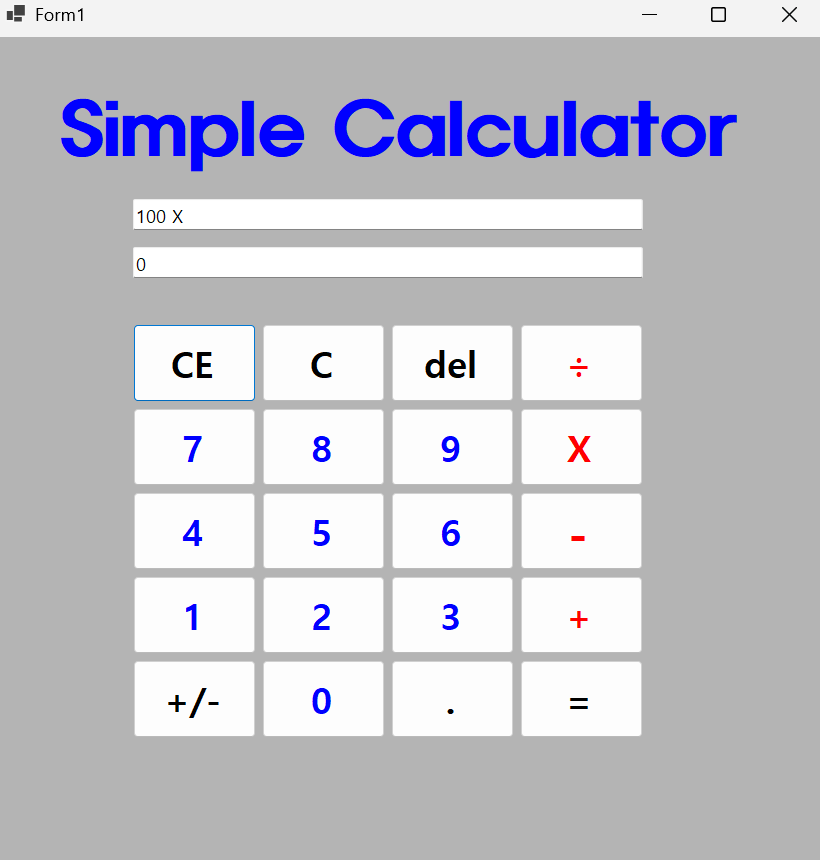
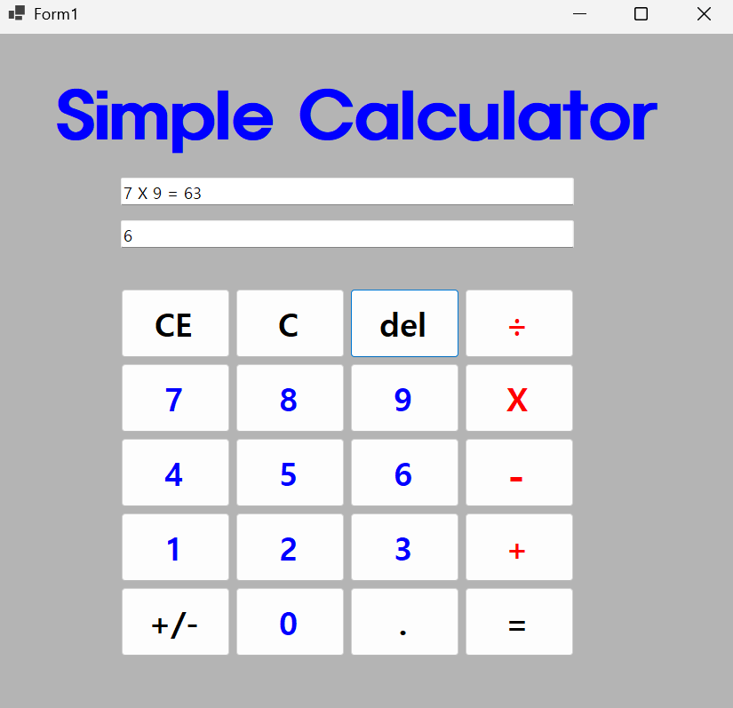
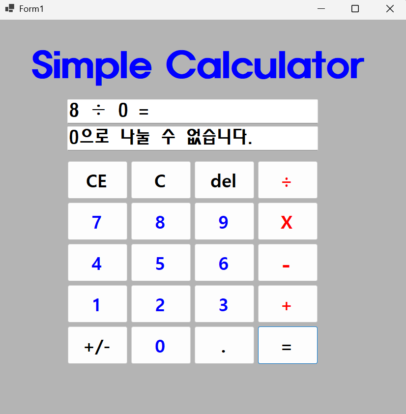
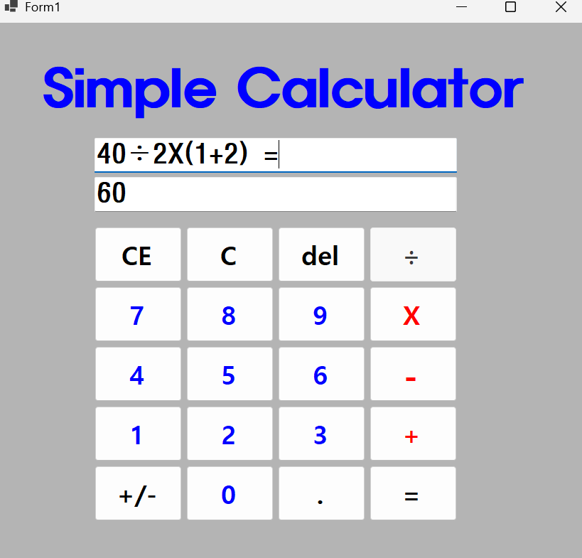

# (C# 코딩) 심플 사칙연산기

## 개요

- C# 프로그래밍 학습
- 1줄 소개: 사용자가 식을 입력하면 계산하는 프로그램
- 사용한 플랫폼:
	- C#, .NET Windows Forms, Visual Studio, GitHub
- 사용한 컨트롤:
	- Label, TextBox, Button
- 사용한 기술과 구현한 기능:
	- 기본 UI 배치 및 2가지 표시 기능 구현 
	- 사칙연산 완성
	- C, CE, Del 버튼 기능 추가 구현
	- 사용자 편의기능과 특수기능 추가
- 수업 중에 배우고 사용했던 클래스들 관련된 설명
- System.Windows.Forms.TextBox: 사용자가 키보드로 수식을 입력하거나 계산 결과를 화면에 출력할 때 사용하는 문자열 입력 및 표시용 컨트롤 클래스이다.
- System.Windows.Forms.Button: 숫자 입력, 연산자 지정, 결과 출력(=) 등 사용자의 클릭 동작을 인식하여 명령을 실행하는 푸시 버튼 컨트롤 클래스이다.
- System.Windows.Forms.Label: 화면에서 수정되지 않는 고정된 안내 텍스트나 현재 계산 상태의 제목을 보여주기 위해 배치하는 읽기 전용 컨트롤 클래스이다.
- System.String (속성 및 메서드 연동): 컨트롤의 Text 속성에 들어있는 문자열 데이터를 다루며, 앞뒤 공백을 제거하는 Trim() 등의 메서드를 제공하는 문자열 관리 클래스이다.
- System.Windows.Forms.Control (Focus 및 Clear 연동): 화면의 포커스를 특정 텍스트박스로 옮겨주는 Focus() 메서드나 내부 값을 초기화하는 Clear() 메서드의 모태가 되는 기본 UI 클래스이다.
- System.Windows.Forms.KeyEventArgs (이벤트 연동): 사용자가 키보드를 누를 때 발생하는 KeyDown 이벤트에서 어떤 키가 눌렸는지(KeyCode)의 물리적 정보를 담아 전달하는 이벤트 데이터 클래스이다.
- System.EventArgs (이벤트 연동): 버튼을 마우스로 클릭할 때 발생하는 Click 이벤트의 가장 기본적인 정보와 신호를 담아 처리기로 넘겨주는 이벤트 규격 클래스이다.

- 실습 중에 구현한 기능들 설명
- 2개의 피연산자의 입력값을 Int로 바꾸어 더하기 계산을 수행하고 그 결과를 저장한다.
- 계산 결과 값을 문자열로 변환하여 표시한다.
- 계산기 프로그램 내 뺄셈(-), 곱셈(X), 나눗셈(÷) 연산 기능 추가 구현한다.
- 기존 덧셈(+) 표준 로직을 재사용하여 연산자만 변경하는 효율적인 이벤트 구현한다.
- 0으로 나누었을 때 '0으로 나눌 수 없습니다' 문구 표시한다.
- 키보드로 식 입력 가능하도록 구현 가능하다.
- Enter 키 입력 시 계산이 수행되고 결과가 표시된다.
- 키보드로 괄호 입력 시 괄호 들어간 식을 구현 가능하다.

## 실행 화면 (과제1)

- 과제1 코드의 실행 스크린샷

- 과제 내용
	- UI 구성
	- 숫자 입력 기능
	- 사칙연산 계산 기능
	- 계산 결과 출력
	- 
- 구현 내용과 기능 설명
	- TextBox(입력표시, 결과표시), Button(계산) 등을 적절히 배치한다.
	- 숫자 Button 클릭 시 TextBox에 표시합니다. 2가지 방법으로 표시한다.
	- 2개의 피연산자의 입력값을 Int로 바꾸어 더하기 계산을 수행하고 그 결과를 저장한다.
	- 계산 결과 값을 문자열로 변환하여 표시한다.
	- C 버튼 클릭 시 현재의 모든 내용을 삭제하고 처음 (초기화된) 상태로 되돌아간다.
	- CE 버튼 클릭 시 마지막 입력한 피연산자(Operand) 값을 삭제한다.
	- del 버튼 클릭 시 마지막 입력된 글자 하나 (숫자 하나) 값을 삭제한다.

## 실행 화면 (과제2)

- 과제2 코드의 실행 스크린샷

- 과제 내용
	- 계산기 프로그램 내 뺄셈(-), 곱셈(X), 나눗셈(÷) 연산 기능 추가 구현
	
- 구현 내용과 기능 설명
	- 뺄셈(-), 곱셈(*), 나눗셈(/) 기능을 추가로 구현한다.
	- 기존 덧셈(+) 표준 로직을 재사용하여 연산자만 변경하는 효율적인 이벤트 구현한다.

## 실행 화면 (과제3)

- 과제3 코드의 실행 스크린샷

- 과제 내용
	- 계산기 프로그램 내 C 버튼 기능 추가 구현
	- 계산기 프로그램 내 CE 버튼 기능 추가 구현
	- 계산기 프로그램 내 del 버튼 기능 추가 구현
	
- 구현 내용과 기능 설명
	- C 버튼 클릭 시 현재의 모든 내용을 삭제하고 처음 (초기화된) 상태로 되돌아간다. (첫 번째 실행화면)
	- CE 버튼 클릭 시 마지막 입력한 피연산자(Operand) 값을 삭제한다. (두 번째 실행화면)
	- del 버튼 클릭 시 마지막 입력된 글자 하나 (숫자 하나) 값을 삭제한다. (세 번째 실행화면)
	

## 실행 화면 (과제4)

- 과제4 코드의 실행 스크린샷

- 과제 내용
	- 0으로 나누었을 때 '0으로 나눌 수 없습니다' 문구 표시
	- 키보드로 식 입력 가능
	
- 구현 내용과 기능 설명
	- 0으로 나누었을 때 '0으로 나눌 수 없습니다' 문구 표시한다.
	- 키보드로 식 입력 가능하도록 구현 가능하다.
	- Enter 키 입력 시 계산이 수행되고 결과가 표시된다.
	- 키보드로 괄호 입력 시 괄호 들어간 식을 구현 가능하다.