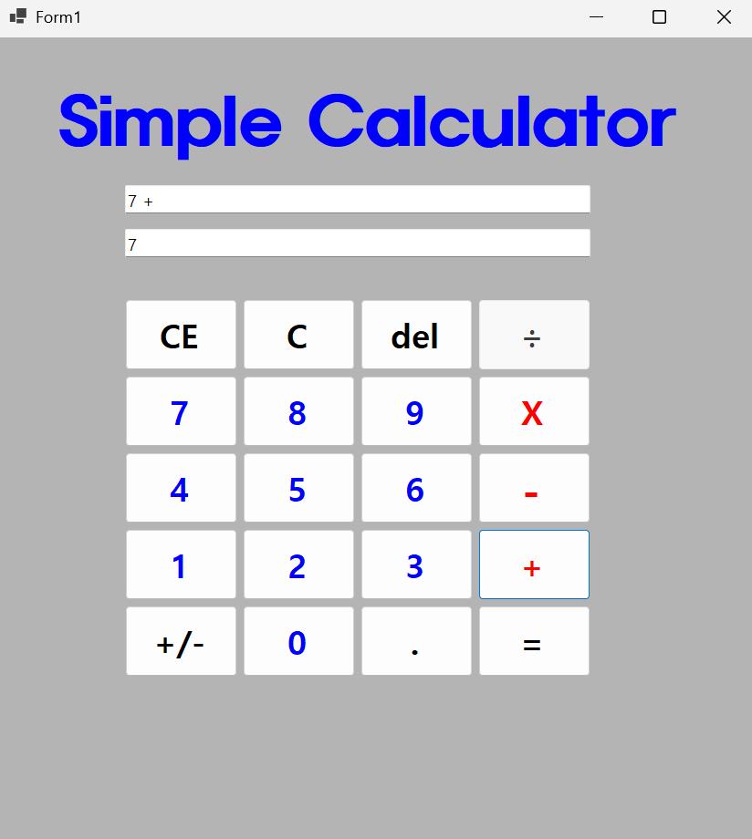
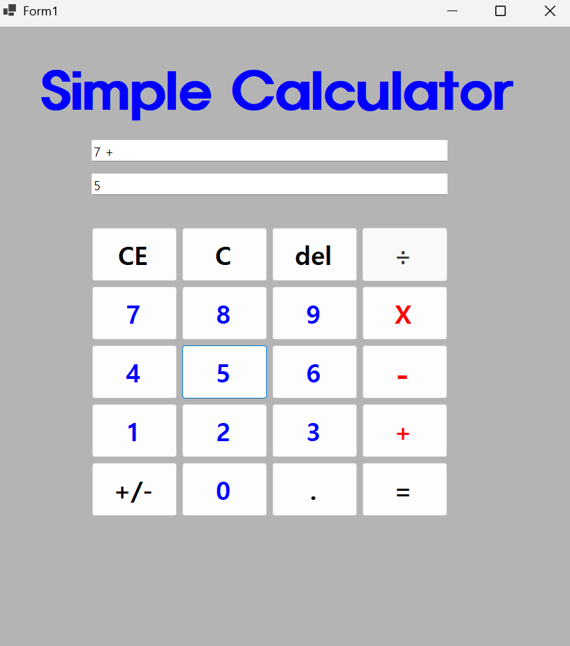
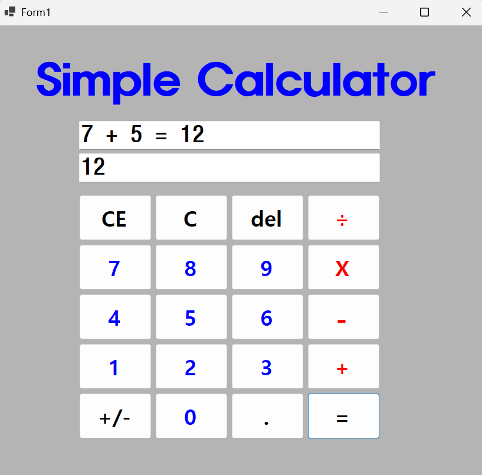

# (C# 코딩) 심플 사칙연산기

## 개요

- C# 프로그래밍 학습
- 1줄 소개: 사용자가 식을 입력하면 계산하는 프로그램
- 사용한 플랫폼:
	- C#, .NET Windows Forms, Visual Studio, GitHub
- 사용한 컨트롤:
	- Label, TextBox, Button
- 사용한 기술과 구현한 기능:
	- 기본 UI 배치 및 2가지 표시 기능 구현 
	- 사칙연산 완성
	- C, CE, Del 버튼 기능 추가 구현
	- 사용자 편의기능과 특수기능 추가
- 수업 중에 배우고 사용했던 클래스들 관련된 설명
-
-
- 실습 중에 구현한 기능들 설명
-
-

## 실행 화면 (과제1)

- 과제1 코드의 실행 스크린샷

- 과제 내용
	- UI 구성
	- 숫자 입력 기능
	- 사칙연산 계산 기능
	- 계산 결과 출력
	- 
- 구현 내용과 기능 설명
	- TextBox(입력표시, 결과표시), Button(계산) 등을 적절히 배치합니다.
	- 숫자 Button 클릭 시 TextBox에 표시합니다. 2가지 방법으로 표시
	- 2개의 피연산자의 입력값을 Int로 바꾸어 더하기 계산을 수행하고 그 결과를 저장합니다.
	- 계산 결과 값을 문자열로 변환하여 표시합니다.